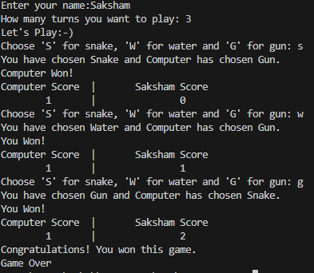

# Snake Water Gun Game

A simple command line game made in Python that lets you play the classic "Snake Water Gun" game against the computer.

## How to Play

- The rules are similar to "Rock Paper Scissors" but with Snake, Water, and Gun:
  - **Snake drinks Water**: Snake wins.
  - **Water drowns Gun**: Water wins.
  - **Gun kills Snake**: Gun wins.
  - If both choices are the same, it's a draw!

## Getting Started

### Prerequisites

- Python 3.x installed on your system

### Running the Game

1. Clone this repository:
    ```bash
    git clone https://github.com/AkshatNigam0104/Snake-Water-Gun.git
    cd Snake-Water-Gun
    ```

2. Run the game:
    ```bash
    python snake_water_gun.py
    ```

## Game Features

- Play against the computer
- Simple text-based UI
- Randomized computer choices
- Keeps score of wins, losses, and draws

## Example


## Author

- [AkshatNigam0104](https://github.com/AkshatNigam0104)

## License

This project is licensed under the MIT License.
